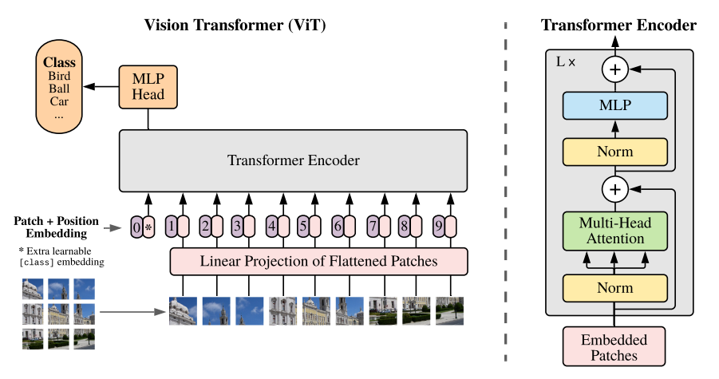

# Vision Transformer

*Knowledge provided by* [AI VIET NAM](https://aivietnam.edu.vn/) 

Reimplementation of Vision Transformer model *based on* [The official implementation for Vision-Transformer](https://github.com/google-research/vision_transformer)

<div style="text-align: center;">
    
</div>

---
## Overview
Click <a href= ./vit/VIT.md> here </a> for explained  VIT's architecture

---
## Installing dependencies
```
> git clone https://github.com/mminh007/vision-transformer.git
> cd vision-transformer
> pip install -r requirements.txt 
```

---

## Run script
```
python ./train.py --output-dir=/outputs --device=cuda 
```

